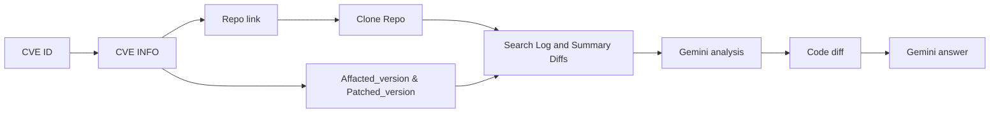
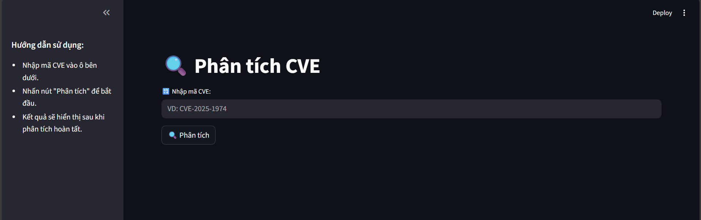

# 🔍 CVE Technical Analysis Pipeline

Hệ thống này hỗ trợ phân tích kỹ thuật các lỗ hổng bảo mật (CVE) bằng cách tự động hóa.

## 🖥️ Yêu cầu hệ thống

- Python 3.6+
- Hệ điều hành: Linux
- API key hợp lệ từ Gemini

## 📁 Cấu trúc hệ thống

```
.
├── run.py                         # File chạy chính
├── requirements.txt               # Danh sách thư viện cần cài
├── README.md                      # Mô tả hệ thống
├── .env                           # Biến môi trường (không commit)
├── .env.example                   # Mẫu biến môi trường
├── .gitignore                     # File loại trừ Git
├── venv/                          # Virtual environment (không commit)
├── output/
│   └── CVE-2025-1974/             # Kết quả phân tích CVE được sinh ra ở đây
├── temp_repos                     # File lưu trữ tạm repo khi chạy tool
└── src/
    ├── analyze/                   
    │   ├── __init__.py
    │   ├── extract_diff.py        # Trích xuất code diff
    │   ├── gemini_analyze.py      # Gọi Gemini để phân tích log và diffs
    │   ├── gemini_ans.py          # Gọi Gemini để trả lời cho vấn đề lỗi
    │   ├── git_diff.py            # Xuất thông tin log và diffs từ repo
    │   └── repo.py                # Xử lý thông tin repo (clone, remove)
    ├── fetch/                     
    │   ├── __init__.py
    │   ├── classify_url.py        # Phân loại link (commit, blog, PoC...)
    │   ├── fetch_info.py          # Lấy thông tin từ CVE org API
    │   └── search_patched_ver.py  # Tìm version bị ảnh hưởng và đã vá
    ├── app.py                     # Giao diện Streamlit
    ├── gemini.py                  # Gọi Gemini sinh nội dung
    ├── normalize.py               # Chuẩn hóa dữ liệu đầu vào
    ├── version_selector.py        # Chuẩn hóa dữ liệu version/tag
    └── write_report.py            # Sinh file markdown báo cáo kết quả

```

## 🔁 Pipeline Phân Tích Tự Động Từ CVE ID



## 📃 Giải thích pipeline

Để tự động hóa tìm kiếm, đầu vào sẽ chỉ là **CVE id** do người dùng nhập vào. Sau đó chương trình tiến hành các bước sau

**Bước 1**: Tiến hành lấy dữ liệu **CVE** và đưa về dạng *json* thông qua **fecth_info.py**.

**Bước 2**: Dựa vào thông tin **CVE**, nếu có *github links* (ở đây là links được phân loại là repo từ **classify_url.py**) thì tools sẽ tự động phân tích tiếp.

**Bước 3**: Tiến hành clone Repo về, sau đó tìm kiếm các thông tin **affacted_version** và **pathced_versrion** và chuẩn hóa nó để phù hợp với thông tin trong repo (**search_patched_ver.py** kết hợp **version_selector.py**).

**Bước 4**: Dựa vào các thông tin ở bước 3, tiến hành kiếm log và summary diffs ở 2 phiên bản rồi đưa vào Gemini để kêu tìm kiếm các file có thể xem là quan trọng khi tiến hành thay đổi.

**Bước 5**: Khi có các file quan trọng (dựa trên đánh giá của Gemini), tiến hành lấy code của các file đó trong 2 phiên bản **affacted_version** và **pathced_versrion**.

**Bước 6**: Đưa các thông tin code diff vào Gemini và yêu cầu đưa ra đánh giá.

Sau khi thực hiện xong, file temp_repos sẽ bị xóa.

## ⚙️ Hướng dẫn sử dụng

- **Tải về bằng cách clone**

```bash
git clone ...
```

- **Tiến hành cài đặt venv**

```bash
python -m venv venv
source venv/bin/activate
```

- **Tiến hành cài các thư viện cần thiết**

```bash
pip install -r requirements.txt
```

- **Thêm thông tin trong .env** với biến ```GEMINI_API_KEY```
- **Sử dụng bằng lệnh python sau**

```bash
python run.py
```

Sau khi chạy run.py, tiến hành truy cập links sau: [http://localhost:8501/](http://localhost:8501/)


Ví dụ về giao diện:

