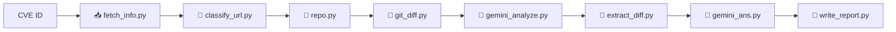

# 🔍 CVE Technical Analysis Pipeline

Hệ thống này hỗ trợ phân tích kỹ thuật các lỗ hổng bảo mật (CVE) bằng cách tự động hóa các bước sau:

## 🚦 Pipeline Phân Tích

## 🔁 Pipeline Phân Tích Tự Động Từ CVE ID

