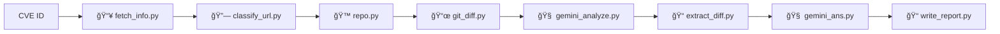

# 🔍 CVE Technical Analysis Pipeline

Hệ thống này hỗ trợ phân tích kỹ thuật các lỗ hổng bảo mật (CVE) bằng cách tự động hóa.

## 🖥️ Yêu cầu hệ thống

- Python 3.6+
- Hệ điều hành: Linux
- API key hợp lệ từ Gemini

## 🔁 Pipeline Phân Tích Tự Động Từ CVE ID



## 🧩 Giải thích 

| Module              | Mô tả chức năng                                                                                          |
| ------------------- | -------------------------------------------------------------------------------------------------------- |
| `fetch_info.py`     | Lấy dữ liệu từ [CVE.org](https://cve.org) bao gồm mô tả lỗ hổng, sản phẩm ảnh hưởng, reference, patch... |
| `classify_url.py`   | Phân loại các liên kết từ `references`: repo (commit/pull), exploit, patch, blog...                      |
| `repo.py`           | Tự động clone repository từ liên kết GitHub (nếu có) để phân tích commit/pull request                    |
| `git_diff.py`       | Phân tích `git log`, `git diff` giữa phiên bản lỗi và bản vá để tìm thay đổi liên quan bảo mật           |
| `gemini_analyze.py` | Gọi mô hình Gemini để phân tích nội dung log và diff, xác định phần nghi ngờ liên quan đến lỗi           |
| `extract_diff.py`   | Dựa trên phân tích Gemini, truy xuất mã nguồn ở cả phiên bản lỗi và phiên bản đã fix                     |
| `gemini_ans.py`     | Gửi mã nguồn (trước/sau) vào Gemini để mô tả chi tiết lỗ hổng, cách khai thác hoặc ảnh hưởng             |
| `write_report.py`   | Tạo báo cáo cuối cùng ở dạng markdown (`.md`), có thể bao gồm bảng, code diff, sơ đồ...                  |

## ⚙️ Hướng dẫn sử dụng

- **Tải về bằng cách clone**

```bash
git clone https://github.com/tuananh244/First_agent.git
```

- **Tiến hành cài đặt venv**

```bash
python -m venv venv
source venv/bin/activate
```

- **Tiến hành cài các thư viện cần thiết**

```bash
pip install -r requirements.txt
```

- **Thêm thông tin trong .env** với biến ```GEMINI_API_KEY```

- **Sử dụng bằng lệnh python sau**

```bash
python run.py
```

Sau khi chạy run.py, tiến hành truy cập links sau: [here](http://localhost:8501)
